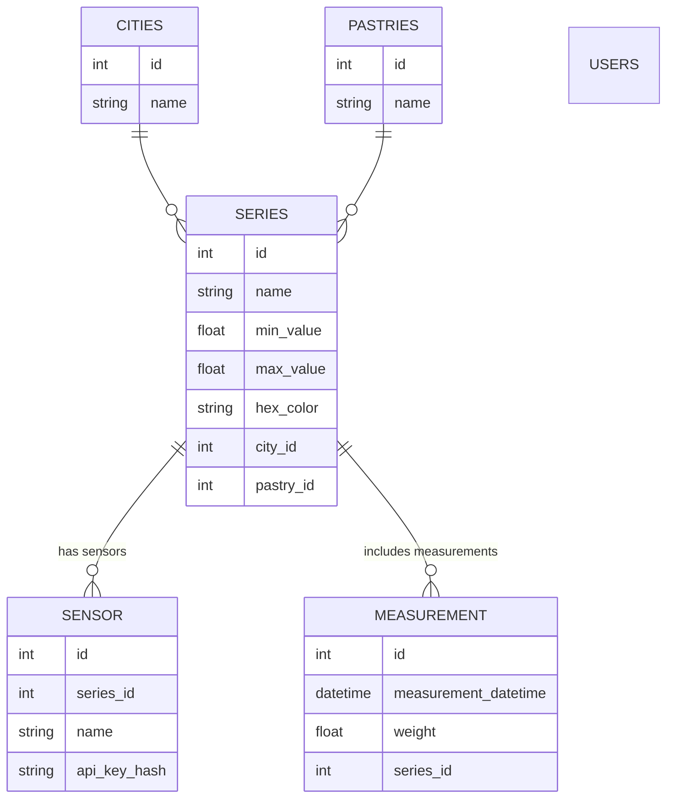

# ZAIUZ
Web application displaying IoT measurements from sensors in multiple series. This project is made for Zaawansowane Aplikacje Internetowe 2026Z in OKNO, WUT.

# ER Diagram

```mermaid
erDiagram
    CITIES ||--o{ SERIES : ""
    PASTRIES ||--o{ SERIES : ""
    SERIES ||--o{ SENSOR : "has sensors"
    SERIES ||--o{ MEASUREMENT : "includes measurements"

    CITIES {
        int id
        string name
    }
    PASTRIES {
        int id
        string name
    }
    SERIES {
        int id
        string name
        float min_value
        float max_value
        string hex_color
        int city_id
        int pastry_id
    }
    SENSOR {
        int id
        int series_id
        string name
        string api_key_hash
    }
    MEASUREMENT {
        int id
        datetime measurement_datetime
        float weight
        int series_id
    }

    USERS {
        
    }
```